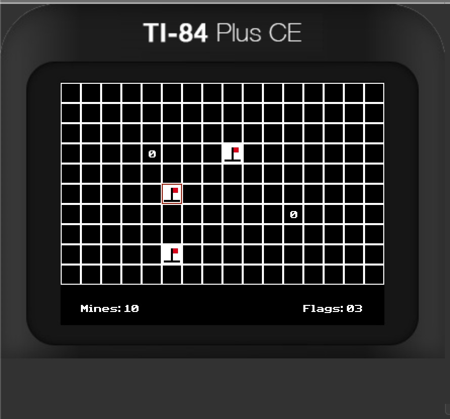

# Minesweeper
 
Minesweeper ported to the TI-84 Plus CE, written in C using the [CEdev toolchain](https://ce-programming.github.io/toolchain/).

## Controls

- **Arrow Keys**: Move the cursor
- **[Enter]**: Reveal a tile
- **[+] (Plus Key)**: Place a flag
- **[Clear]**: Remove a flag
- **[Del]**: Quit the game

## Installation

To build from source, ensure you have the CEdev toolchain installed. Then once you clone the respository, run:

```sh
make clean && make gfx && make
```

This will generate the `.8xp` file for use on the calculator.  
Transfer the file to your TI-84 Plus CE calculator using [TI-Connect CE](https://education.ti.com/en/products/computer-software/ti-connect-ce-software).  
Run the program using a shell like Cesium or AsmPgrm().

## Known Issues

- Performance may slow down on large grid sizes.
- No difficulty selection yet (planned for future updates).

## License

This project is released under the MIT License. Feel free to modify and distribute!

## Acknowledgments

- CEdev Toolchain developers  

## Screenshots  
 
